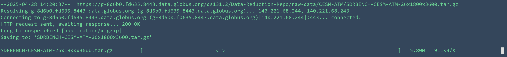
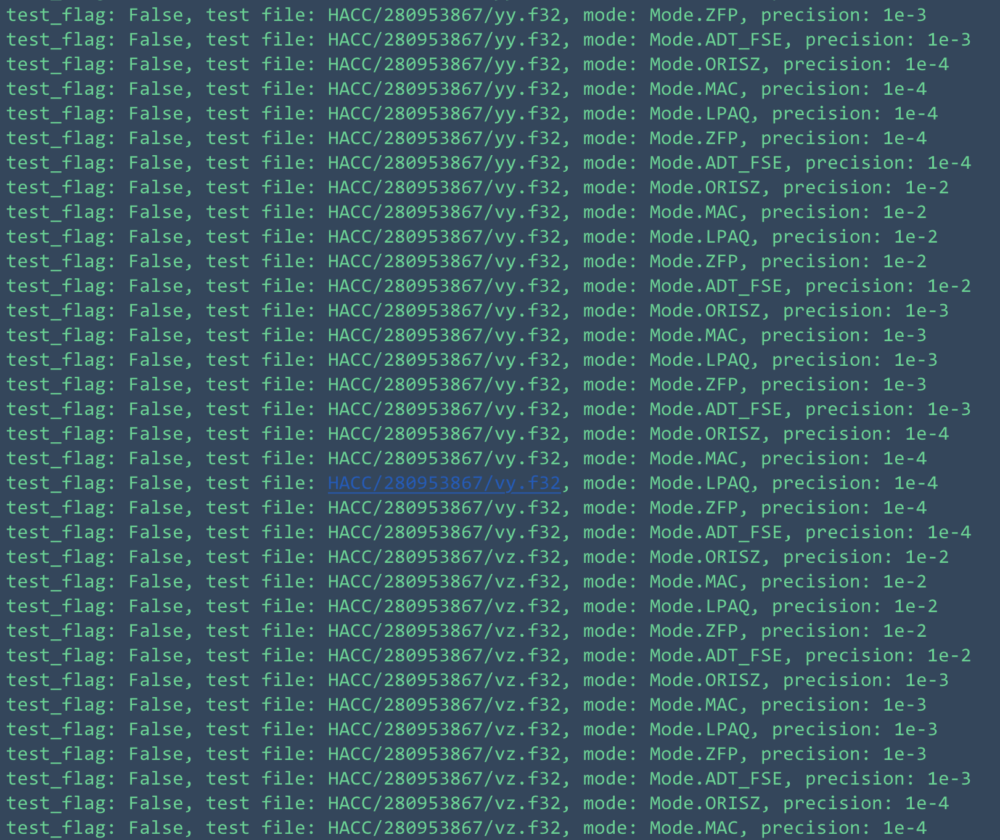
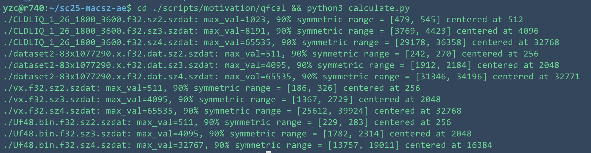
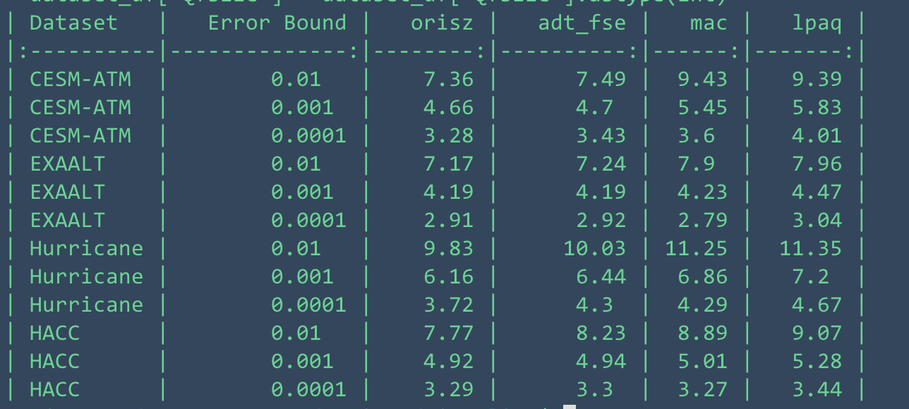
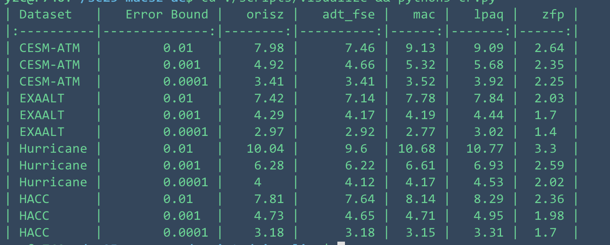
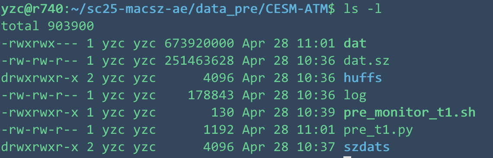
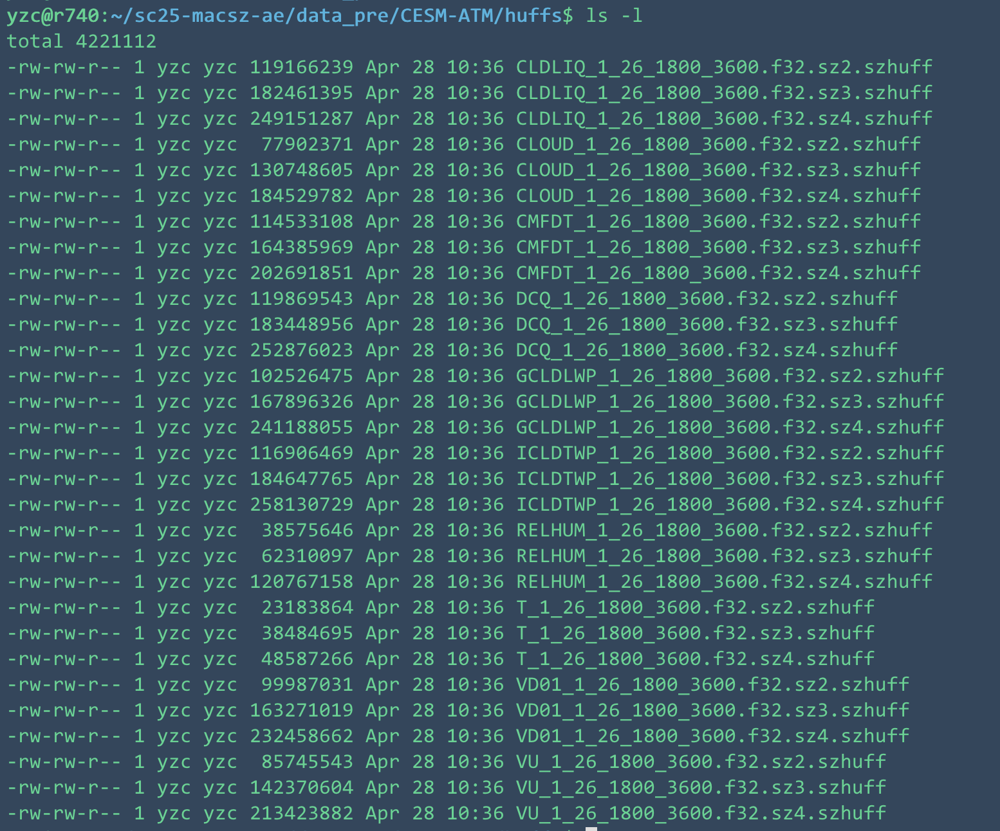
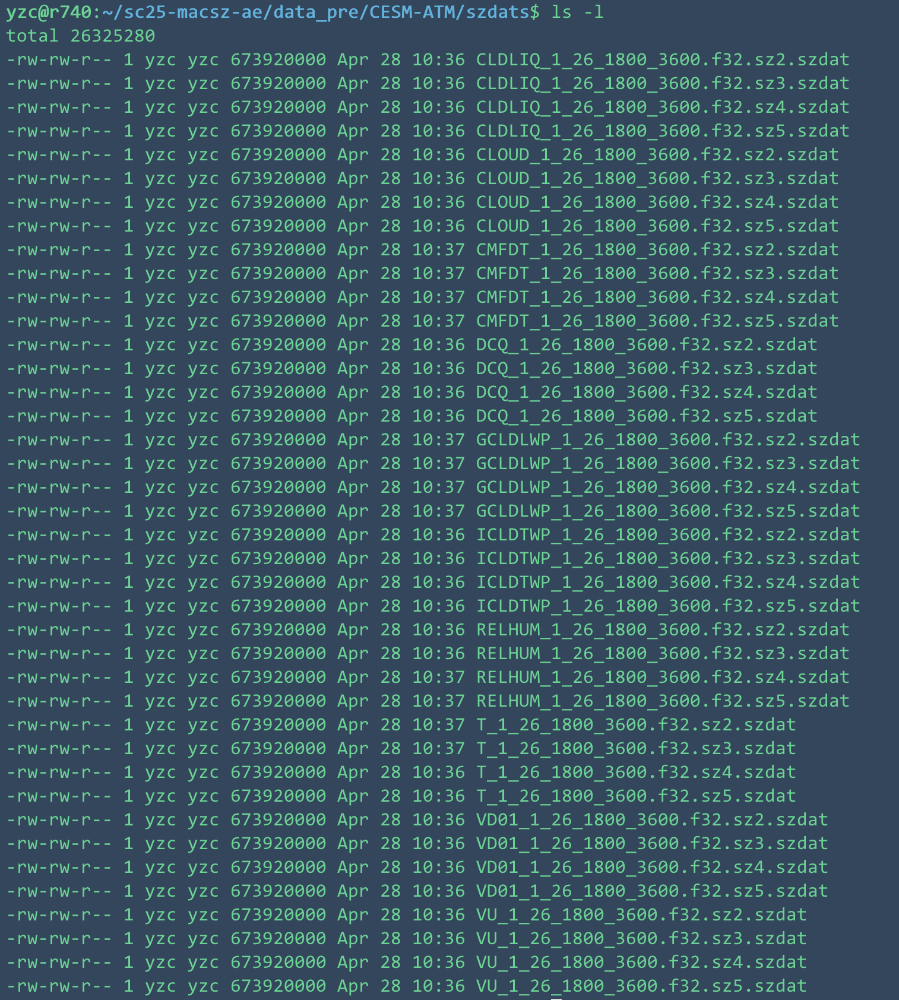
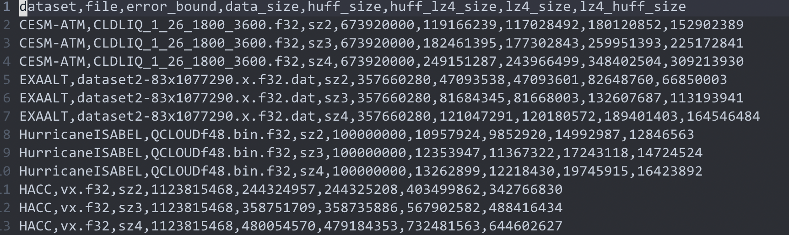

# Different Approaches

SZ -- original SZ compressor 

ADT-FSE-SZ -- Using addition adaptation table and fse to replace SZ's huffman encoder

MAC-SZ -- our approach, using tailored modeling-based arithmetic coding as the quantization factor encoder

LPAQ-SZ -- using lpaq as the quantization factor encoder

ZFP --  another well-known lossy compressor 

See these approaches and their implementations in the "/src" directory. 

# Test Data:

The tested data we use in the paper are originally downloaded from the sdrbench page[https://sdrbench.github.io/]. Please run the following command to download the data we use in the paper:

```
cd ./scripts && ./download.sh
```

This might take a while, the process should look like this in your terminal:



# How to get the pictures we draw in the paper

<!-- 0. to run all the tests and draw the picture in one command:
'''
'''

If the run-all script does not work, follow the following step to check which exact step went run and send issues to us if it cannot be easily solved. -->
## Compile 
Compile all the approaches: 

```
cd ./scripts && ./compile.sh 
```
## Run
Run the standalone tests, this might take about a day to finish:
```
cd ./scripts/pw_rel_test/ 
nohup ./scripts/pw_rel_test/szt_monitor.sh > monitor_log 2>&1 &
```

To check if the tests are all finished, use the scripts we provide here:
```
cd ./scripts/pw_rel_test/ 
python3 progress.py 
```
This will show you the progress of the tests, and the test_flag of each approach. A typical output should look like this:



If all the test_flag are "False", it means the process has finished, otherwise just wait a few more hours.

Notice that you could have different results if the tested files you run are not the tested files we provide in the paper. For example, we only test the first 15 files in the CESM-ATM dataset, if the scripts run differently in your machine, it might be because you are testing different files. Still, the results should be similar to the ones we provide in the paper. But if you want to get the exact same results, check the results in the ./scripts/pw_rel_test/result(which is our tested results) and delete all the files not included in the result from the origin dataset directory and run the tests again.

If you find it too slow, you could change the pool size in the scripts/pw_rel_test/sztest.py in the following line:
```
...
modes = [Mode.ORISZ, Mode.MAC, Mode.LPAQ, Mode.ZFP, Mode.ADT_FSE] 
pool_size = 1 
tasks = []
...
```

## Visualizing Scripts for Non-hpc Tests
Get the standalone evalution data/pictures we give in the paper, follow the following steps.

### Preprocess the results

If you run the above scripts using pool size number equal or greater than 2, it could get very messy. To make the results easier to read, we provide a script to preprocess the results. 

```
cd ./scripts/visualize && python3 preprocess.py
```
This will generate a new file('./scripts/visualize/datap/pw_rel.csv') which is easier to read.

### Figure 3

Figure 3 in ./scripts/motivation/qf_ratio.pdf
```
cd ./scripts/motivation && python3 qfsize.py
```

### Figure 4 

Figure 4 in ./scripts/motivation/*_compression_ratios.pdf
```
cd ./scripts/motivation && python3 lz_huff.py
```

### Table 2

Table 2 in stdout
```
cd ./scripts/motivation/qfcal && python3 calculate.py
```
It should look like this:


### Table 4 
Table 4 in stdout
```
cd ./scripts/visualize && python3 qfcr.py
```
It should look like this:


### Table 5
Table 5 in stdout
```
cd ./scripts/visualize && python3 cr.py
```
It should look like this:


### Figure 9
Figure 9 in ./scripts/visualize/pics/CESM-ATM_0.01_qfsize.pdf
```
cd ./scripts/visualize && python3 qfr.py
```

### Figure 10
Figure 10 in ./scripts/visualize/pics/ctime.pdf && ./scripts/visualize/pics/dtime.pdf
```
cd ./scripts/visualize && python3 ct.py && python3 dt.py
# Figure 13 in ./scripts/prefix_test/prefix.pdf
```

### Figure 13
Figure 13 in ./scripts/prefix_test/prefix.pdf. This process might take a very long time.
```
cd ./scripts/prefix_test && python3 test.py
python3 draw.py
```


## Cluster Test

Cluster tests are done in Tianhe-2 system, we simulate read and write using "pv" cmd and make sure the speed is the same as the given speed of SZ's original paper, namely 4.28TB/h dumping and 3Tb/h loading. 

Run the following command to see Figure 11 and 12:
```
cd ./scripts/visualize && python3 hpc.py
```
See all the figures in ./scripts/hpc/*.pdf

## Motivation Test 

The data in the scripts above about motivations is hard-coded. To run the scripts and get the results yourself, follow these steps:
```
cd ./data_pre/CESM-ATM && python3 pre_t1.py
cd ./data_pre/EXAALT && python3 pre_t2.py
cd ./data_pre/HurricanISABEL && python3 pre_t3.py
cd ./data_pre/HACC && python3 pre_t4.py
```
After these steps, you should have similar results:



where huffs are huffman codes of the quantization factors and szdats are the quantization factors themselves.

Then you can run the scripts given in ./data_pre/scripts:
```
cd ./data_pre/scripts 
g++ huffman.cpp -o huffman
python3 compare_huff_lz.py
```
After this, you will get the results in ./data_pre/scripts/results, it should look like this within:


Then go to the ./data_pre/visualize and run the following scripts:
```
cd ./data_pre/visualize
python3 calculate.py
```